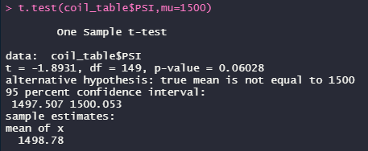
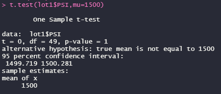
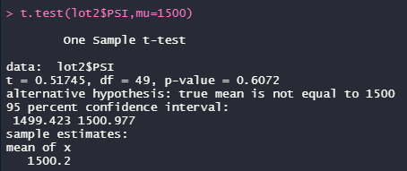
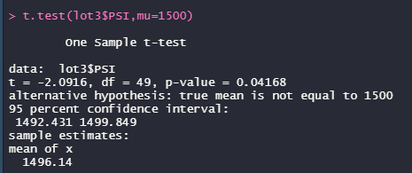

# MechaCar Statistical Analysis
## Linear Regression to Predict MPG
Utilizing the data within the MechaCar_mpg.csv, I created a linear regression model to look at which variables, if any, have a significant effect on the miles per gallon (mpg) of the 50 MechaCar prototypes. These variables included vehicle length, vehicle weight, spoiler angle, ground clearance, and drivetrain (AWD).

The vehicle length and ground clearance (as well as the intercept) are statistically unlikely to provide random amounts of variance to the mpg values in the dataset. In other words, these variables have a significant impact on mpg. 

The slope of the linear model is not zero. The p-Value of this model is 5.35e-11, much smaller than the standard significance level of 0.05. This indicates there is enough statistically significant evidence to reject the null hypothesis that the slope was zero. 

This linear model predicts mpg of MechaCar prototypes effectively as the r-squared value is 0.71, indicating roughly 71% of the variability of mpg predictions are explained with this linear model.

## Summary Statistics on Suspension Coils
The weight capacities (in PSI) of multiple suspension coils from several production lots were tested for consistency. The data was compiled into the Suspension_Coil.csv. i have created the summary statistics tables below, in both total summary of all coils and by manufacturing lot.

The overall total variance in PSI is **62.29**, well within the 100 PSI variance requirement. However, when looking at the manufacturing lots individually, Lot1 and Lot2 are within range (**0.98** and **7.47**, respectively) while Lot3 is well over this variance limit at **170.29**. A simple boxplot of the PSI of each lot shows that Lot3 has multiple outlying values both low and high, giving Lot3 such a large variance and contributing to the majority of variance in the total coil summary.

## T-Tests on Suspension Coils

The mean of the PSI across all manufacturing lots is **1,498.78** with a p-value of **0.06**. This p-value is above the standard significance level of 0.05, indicating there is not enough statistically significant evidence to reject the null hypothesis. Therefore, the mean of the total PSI across all lots is statistically similar to the population mean of 1,500 PSI.

The mean of the PSI across Lot 1 is **1,500**, with a p-value of **1**. This p-value is above the standard significance level of 0.05, indicating there is not enough statistically significant evidence to reject the null hypothesis. This makes sense that the PSI for Lot 1 is statistically similar to the true population mean as it matches it exactly.

The mean of the PSI across Lot 2 is **1,500.2**, with a p-value of **0.61**. This p-value is above the standard significance level of 0.05, indicating there is not enough statistically significant evidence to reject the null hypothesis. Therefore, the mean of PSI for Lot 2 is statistically similar to the population mean of 1,500 PSI.

The mean of the PSI across Lot 3 is **1,496.14**, with a p-value of **0.04**. This p-value is below the standard significance level of 0.05, rejecting of the null hypothesis and indicating there is a statistical difference between the PSI mean for Lot 3 and the  presumed population mean.

Given all of the evidence, there is clearly an issue with Lot 3 of the suspension coils and the manufacturing cycle should be revisited for troubleshooting purposes. Vehicles with out-of-compliance suspension coils should have new coils installed and any vehicle data reliant on the coils should be retested.

## Study Design: MechaCar vs Competition

This proposed statistical study is to look at which color cars have the greatest selling success rate, specifically in cars designed similarly to the MechaCar. By reviewing similar cars sold by both AutosRUs and the competition, AutosRUs can plan for the most appealing colors of MechaCars. 

### Metrics

The metrics to test are color of car (independent, categorical variable), and days on lot (dependent, continuous, numerical variable)

### Hypotheses

Null hypothesis: The means of all groups are equal (there is no specific color that sells faster than another)
Alternatice hypothesis: At least one of the means is different from all other groups (at least one car color sells at a different pace than others)

### Statistical Test

I would use a one-way ANOVA test as these metrics include both categorical and numerical data types. An ANOVA test allows for looking at a variable with multiple groups (car color) along with a continuous measured variable (time or days on lot).

### Data
Cars that are in a similar marketed bracket to the MechaCar (class, cost, drivetrain, engine, fuel efficiency, etc.) with columns for Vehicle_Color and Days_On_Lot would need to be compiled into a single dataframe.   